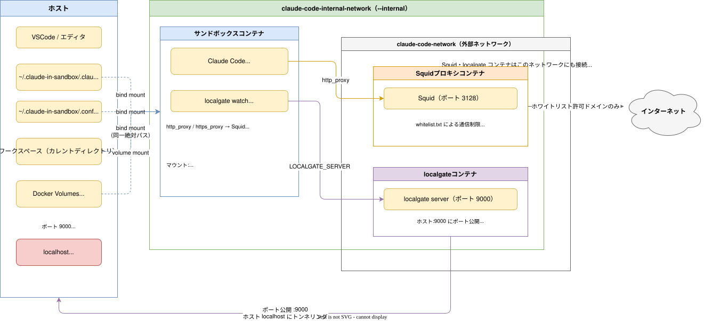

# Claude Codeのサンドボックス

Claude Codeを安全に`--dangerously-skip-permissions`付きで動かすためのサンドボックス。

## 特徴

- Dockerコンテナに閉じ込めることで、予期せぬファイル更新・削除を防ぐ(例: `rm -fr $HOME`など)
- `internal`なDockerネットワークに閉じ込めることで、予期せぬ通信を防ぐ(例: 怪しいウェブサイトへのPOSTリクエストなど)
- bindマウントは最低限、ワークスペースとして扱うディレクトリのみ
- インターネット通信は`internal`なネットワークと`internal`でないネットワークの両方へ接続しているSquidコンテナを経由して行う
- ホスト側はVSCode等のエディタで該当ディレクトリを開いてClaude Codeが作成・編集したファイルを確認する



## 前提条件

- Dockerがインストール済みかつ起動していること

## インストール

このリポジトリを`git clone`する。

```bash
git clone https://github.com/backpaper0/claude-code-environment.git
```

パスが通っている場所へシンボリックリンクを作成する。

```bash
ln -s $PWD/claude-in-sandbox $HOME/.local/bin/claude-in-sandbox
```

## 起動

作業対象のディレクトリへ移動してコマンドを実行する。

```bash
cd /path/to/your/project
claude-in-sandbox
```

実行すると必要に応じてコンテナイメージの作成、Dockerネットワークの作成、Squidコンテナの起動などを行い、Claude Codeが動くコンテナが起動する。
カレントディレクトリがコンテナ内の同一絶対パス（例: `/path/to/your/project`）としてマウントされ、作業ディレクトリとなる。

## 初回認証

コンテナ起動後、初回は Claude Code のログインが必要になる。

```bash
claude
```

を実行すると認証フローが始まるので、案内に従って Anthropic アカウントでログインする。
認証情報はホスト側の `~/.claude-in-sandbox` ディレクトリに保存されるため、2回目以降は再認証不要。

## カスタマイズ

### 環境変数

以下の環境変数でデフォルト値を上書きできる。

| 環境変数 | デフォルト値 | 説明 |
| --- | --- | --- |
| `CC_SANDBOX_PREFIX` | (空文字) | 各リソース名に付けるプレフィックス。複数環境を使い分けたい場合に設定する |
| `CC_SANDBOX_IMAGE` | `claude-code` | 使用するDockerイメージ名 |
| `CC_SANDBOX_NETWORK` | `claude-code-network` | 外部接続用Dockerネットワーク名 |
| `CC_SANDBOX_INTERNAL_NETWORK` | `claude-code-internal-network` | 内部専用Dockerネットワーク名 |
| `CC_SANDBOX_PROXY_CONTAINER` | `claude-code-proxy` | Squidプロキシコンテナ名 |
| `CC_SANDBOX_USER` | `claude` | コンテナ内のユーザー名 |
| `CC_SANDBOX_DOTCLAUDE` | `~/.claude-in-sandbox/.claude` | ホスト側の `.claude` ディレクトリのパス（認証情報や設定が保存される） |
| `CC_SANDBOX_DOTCONFIG` | `~/.claude-in-sandbox/.config` | ホスト側の `.config` ディレクトリのパス |
| `CC_SANDBOX_SHARE_MISE_VOLUME` | `claude-code-share-mise` | mise の共有データを保存する Docker ボリューム名 |
| `CC_SANDBOX_STATE_MISE_VOLUME` | `claude-code-state-mise` | mise の状態データを保存する Docker ボリューム名 |
| `CC_SANDBOX_M2_REPO` | `claude-code-m2-repo` | Maven ローカルリポジトリを保存する Docker ボリューム名 |
| `CC_SANDBOX_M2_WRAPPER` | `claude-code-m2-wrapper` | Maven Wrapper のキャッシュを保存する Docker ボリューム名 |

### オプション

| オプション | 説明 |
| --- | --- |
| `--volume HOST:CT`, `-v HOST:CT` | ホストのパスをコンテナにマウントする。`HOST:CONTAINER` または `HOST:CONTAINER:ro` 形式。繰り返し指定可 |
| `--env VAR=VALUE`, `-e VAR=VALUE` | コンテナに環境変数を設定する。`VAR=VALUE` または `VAR`（ホストから継承）形式。繰り返し指定可 |
| `--build`, `-b` | Dockerfile が変更されていなくてもイメージを強制的に再ビルドする |
| `--no-cache` | キャッシュを使わずにイメージをビルドする（`--build` を含む） |
| `--list-mounts` | コンテナが使用するすべてのバインドマウントとボリュームを表示する |
| `--cleanup` | このスクリプトが作成したすべての Docker リソースを停止・削除する |
| `--force`, `-f` | `--cleanup` と組み合わせて確認プロンプトをスキップする |
| `--help`, `-h` | ヘルプメッセージを表示して終了する |

### 追加マウント・環境変数の指定

起動時に `-v` / `-e` オプションで追加のマウントや環境変数をコンテナに渡せる。

```bash
claude-in-sandbox -v /path/to/host:/path/in/container -e MY_VAR=value
```

### アクセス許可ドメインの変更

コンテナからのHTTP/HTTPSアクセスはSquidプロキシ経由に制限されており、`proxy/whitelist.txt` に記載されたドメインのみ通信が許可される。
アクセスを許可したいドメインを追加・削除する場合はこのファイルを編集する。
Squidの `dstdomain` 形式に従い、`.example.com` と記載するとサブドメインを含むすべてのホストが対象になる。

### 同一ネットワーク上の他コンテナへのアクセス

サンドボックスコンテナからのインターネット通信はSquidプロキシ経由になるが、同一の内部Dockerネットワーク(`CC_SANDBOX_INTERNAL_NETWORK`)に接続している他のコンテナへはプロキシを経由せず直接アクセスできる。

これは `no_proxy` 環境変数に `.test` が含まれているため、末尾が `.test` のドメイン名（ホスト名）を持つコンテナへのリクエストはプロキシをバイパスする仕組みによる。

他のコンテナを内部ネットワークへ接続する際は `--hostname <名前>.test` を指定することで、サンドボックスコンテナからプロキシなしで直接アクセスできる。

#### 例: Nginxコンテナへのアクセス

Nginxコンテナを内部ネットワークに接続して起動する。

```bash
docker run --rm --detach \
  --name my-nginx \
  --hostname my-nginx.test \
  --network claude-code-internal-network \
  nginx
```

サンドボックスコンテナ内から `curl` でアクセスできることを確認する。

```bash
curl http://my-nginx.test
```

プロキシを経由していないことを確認したい場合は `-v` オプションを付けて実行する。`* CONNECT` や `* Using proxy` のような表示がなければプロキシをバイパスしている。

```bash
curl -v http://my-nginx.test
```
